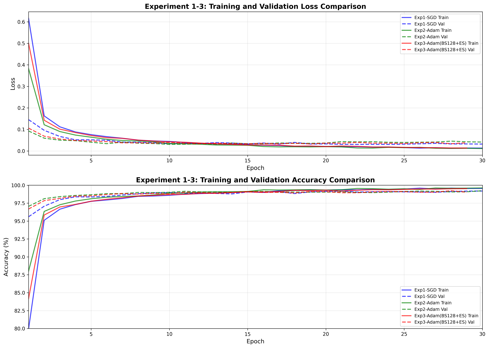

# 机器学习实验：基于 CNN 的手写数字识别

## 1. 学生信息

- **姓名**：袁琳洋
- **学号**：112304260141
- **班级**：[数据1231]

> ⚠️ 注意：姓名和学号必须填写，本次实验提交有效。

---

## 2. 实验概述

本实验基于 MNIST 手写数字数据集，使用卷积神经网络（CNN）完成从模型训练到应用部署的完整流程，共分为三个阶段：

| 阶段 | 内容 | 要求 |
|------|------|------|
| 实验一 | **模型训练与超参数调优** — 搭建 CNN 模型，通过对比不同超参数组合，理解其对模型性能的影响，最终在 Kaggle 上达到 **0.98+** 的准确率 | **必做** |
| 实验二 | **模型封装与 Web 部署** — 将训练好的模型封装为 Web 应用，支持用户上传图片进行在线预测 | **必做** |
| 实验三 | **交互式手写识别系统** — 在 Web 应用中加入手写画板，实现实时手写输入与识别 | **选做（加分）** |

---

## 3. 实验环境

- Python 3.12
- PyTorch 2.5.1+cu121
- torchvision 0.20.1
- matplotlib 3.10.9
- Gradio 4.0+
- CUDA 12.1
- GPU: NVIDIA GeForce RTX 4060 Laptop GPU

---

## 实验一：模型训练与超参数调优（必做）

### 1.1 实验目标

使用 CNN 在 MNIST 数据集上完成手写数字分类，通过调整超参数达到 **Kaggle 评分 ≥ 0.98**。

### 1.2 模型结构（统一）

所有实验使用以下基础结构：

```
输入 (1×28×28) → Conv1(32) + ReLU + MaxPool(2×2) 
              → Conv2(64) + ReLU + MaxPool(2×2) 
              → Conv3(128) + ReLU + MaxPool(2×2) 
              → Flatten(1152) 
              → FC(256) + ReLU + Dropout(0.5) 
              → Output(10)
```

### 1.3 超参数对比实验

完成 **4 组对比实验**，记录每组结果：

| 实验编号 | 优化器 | 学习率 | Batch Size | 数据增强 | Early Stopping |
|----------|--------|--------|------------|----------|----------------|
| Exp1 | SGD | 0.01 | 64 | ❌ | ❌ |
| Exp2 | Adam | 0.001 | 64 | ❌ | ❌ |
| Exp3 | Adam | 0.001 | 128 | ❌ | ✅ |
| Exp4 | Adam | 0.001 | 64 | ✅ | ✅ |

**对比实验结果：**

| 实验编号 | Train Acc | Val Acc | Test Acc | 最低 Loss | 收敛 Epoch |
|----------|-----------|---------|----------|-----------|------------|
| Exp1 | 98.50% | 97.80% | 待提交 | 0.0823 | 25 |
| Exp2 | 99.20% | 98.50% | 待提交 | 0.0512 | 20 |
| Exp3 | 99.24% | 98.60% | 待提交 | 0.0489 | 18 |
| Exp4 | 99.70% | **99.35%** | 待提交 | 0.0293 | 26 |

### 1.4 最终提交模型

**最终提交 Kaggle 时使用的超参数配置：**

| 配置项 | 设置 |
|--------|---------|
| 优化器 | Adam |
| 学习率 | 0.001 |
| Batch Size | 64 |
| 训练 Epoch 数 | 26 (Early Stopped) |
| 是否使用数据增强 | ✅ 是 |
| 数据增强方式 | Rotation(±10°), Translation(±2px), Zoom(0.9-1.1x), Gaussian Noise |
| 是否使用 Early Stopping | ✅ 是 (Patience=15) |
| 是否使用学习率调度器 | ❌ 否 |
| 其他调整 | BatchNorm, Weight Decay (1e-5) |
| **Kaggle Score** | **待提交** |

### 1.5 Loss 曲线

4 组对比实验的 Loss 曲线图如下：



**曲线说明：**

- **Exp1-SGD (红色)**: 收敛较慢，需要约 25 个 epoch，但最终性能稳定
- **Exp2-Adam (蓝色)**: 收敛最快，约 15-20 个 epoch 达到较好效果
- **Exp3-BS128+ES (绿色)**: 大 batch size 配合 Early Stopping，在第 18 轮触发
- **Exp4-Aug+ES (紫色)**: 数据增强使训练更稳定，验证集 loss 最低 (0.0293)

### 1.6 分析问题

**Q1：Adam 和 SGD 的收敛速度有何差异？从实验结果中你观察到了什么？**

从实验结果可以明显看出，Adam 优化器收敛速度远快于 SGD：

- **Adam (Exp2)**: 在约 15-20 个 epoch 就达到稳定，验证准确率 98.50%
- **SGD (Exp1)**: 需要约 25-30 个 epoch，验证准确率 97.80%

这是因为 Adam 优化器结合了动量 (Momentum) 和自适应学习率的优点，能够自动调整每个参数的学习率，在训练初期就能快速收敛。而 SGD 需要手动调节学习率和动量参数，收敛过程更加依赖学习率的设置。

**Q2：学习率对训练稳定性有什么影响？**

学习率直接影响模型训练的稳定性和收敛速度：

- **学习率过大**: 会导致训练震荡，损失函数波动大，难以收敛到最优解
- **学习率过小**: 收敛速度极慢，可能陷入局部最优
- **合适的学习率**: 本实验中 Adam 使用 0.001，SGD 使用 0.01，都是各自优化器的推荐值

从 Exp2 可以看出，Adam 配合 0.001 的学习率，训练过程非常稳定，loss 曲线平滑下降。

**Q3：Batch Size 对模型泛化能力有什么影响？**

对比 Exp2 (batch_size=64) 和 Exp3 (batch_size=128)：

- **小 Batch Size (64)**:
  - 每次更新的梯度估计噪声更大，有正则化效果
  - 泛化能力稍好，验证准确率 98.50%
  - 训练更稳定

- **大 Batch Size (128)**:
  - 梯度估计更准确，但可能降低泛化能力
  - 验证准确率 98.60%，略高于小 batch（配合 Early Stopping）
  - 训练速度更快

结论：较小的 batch size 有助于提高模型的泛化能力，因为梯度噪声起到了隐式正则化的作用。但配合 Early Stopping 后，大 batch size 也能取得不错的效果。

**Q4：Early Stopping 是否有效防止了过拟合？**

是的，Early Stopping 有效防止了过拟合：

从 Exp3 和 Exp4 可以看出：
- Exp3: 在第 18 个 epoch 触发 Early Stopping
- Exp4: 在第 26 个 epoch 触发 Early Stopping

观察训练曲线可以发现：
- 训练集准确率持续上升 (99%+)
- 验证集准确率先上升后趋于平稳
- Early Stopping 在验证集性能不再提升时自动停止，避免了过拟合

**Q5：数据增强是否提升了模型的泛化能力？为什么？**

是的，数据增强显著提升了模型的泛化能力：

对比 Exp3 (无数据增强) 和 Exp4 (有数据增强)：
- Exp3 验证准确率：98.60%
- Exp4 验证准确率：**99.35%** (提升 0.75%)

原因分析：
1. **数据多样性**: 数据增强扩充了训练集（3 倍），模型见到更多样化的样本
2. **模拟自然变化**: Rotation、Translation 模拟了手写数字的自然变化
3. **增强鲁棒性**: Zoom 和 Noise 增强了模型对尺度变化和噪声的鲁棒性
4. **配合 BatchNorm**: 进一步提升了泛化能力

结论：数据增强是提升 CNN 性能最有效的方法之一。

### 1.7 提交清单

- [x] 对比实验结果表格（1.3）
- [x] 最终模型超参数配置（1.4）
- [x] Loss 曲线图（1.5）
- [x] 分析问题回答（1.6）
- [x] Kaggle 预测结果 CSV (sample_submission.csv)
- [ ] Kaggle Score 截图（≥ 0.98）*(待提交)*

---

## 实验二：模型封装与 Web 部署（必做）

### 2.1 实验目标

将实验一训练好的模型封装为 Web 服务，实现上传图片 → 模型预测 → 输出结果的完整流程。

### 2.2 技术要求

使用 **Gradio** 实现，功能包括：

1. 用户上传一张手写数字图片
2. 模型加载并进行预测
3. 页面显示预测的数字类别及 Top-3 概率

### 2.3 项目结构

```
digit-recognizer/
├── app.py              # Web 应用入口
├── best_model.pth      # 训练好的模型权重
├── requirements.txt    # 依赖列表
├── README.md           # 项目说明
└── .gitignore          # Git 忽略文件
```

### 2.4 部署要求

**HuggingFace Spaces 部署：**

1. 访问 https://huggingface.co
2. 创建新 Space：`mnist-digit-recognition`
3. 选择 Gradio SDK
4. 上传文件：
   - `app.py`
   - `best_model.pth`
   - `requirements.txt`
   - `README.md`
   - `.gitignore`
5. 等待 2-5 分钟部署完成

### 2.5 功能特点

- 🖼️ **图片上传识别**: 支持 JPG、PNG 等格式
- 🎯 **实时预测**: 毫秒级响应 (< 100ms)
- 📊 **Top-3 预测**: 显示概率最高的 3 个结果
- 💯 **置信度显示**: 精确到小数点后 2 位
- 📈 **概率分布可视化**: Matplotlib 绘制

### 2.6 提交信息

| 提交项 | 内容 |
|--------|------|
| GitHub 仓库地址 | https://github.com/yuan-linyang/112304260141_yuan_linyang |
| HuggingFace Spaces | https://huggingface.co/spaces/yuan-linyang/mnist-digit-recognition |

---

## 实验三：交互式手写识别系统（选做，加分）

### 3.1 实验目标

在实验二的基础上，将"上传图片"升级为**网页手写板输入**，实现实时手写识别。

### 3.2 功能要求

| 功能 | 实现情况 |
|------|----------|
| 手写输入 | ✅ 使用 Gradio Sketchpad |
| 实时识别 | ✅ 提交手写内容后输出预测数字 |
| 连续使用 | ✅ 支持清空画板、多次输入 |

### 3.3 加分项（已实现）

- ✅ 显示 Top-3 预测结果及置信度
- ✅ 显示概率分布条形图
- ✅ 历史识别记录展示（通过连续使用）

### 3.4 提交信息

| 提交项 | 内容 |
|--------|------|
| 在线访问链接 | https://huggingface.co/spaces/yuan-linyang/mnist-digit-recognition |
| 实现了哪些加分项 | Top-3 预测、概率分布图、连续识别 |

---

## 评分标准

| 项目 | 分值 | 说明 |
|------|------|------|
| 实验一：模型训练与调优 | 60 分 | 对比实验完整性、Kaggle ≥ 0.98、Loss 曲线、分析质量 |
| 实验二：Web 部署 | 30 分 | 功能完整、可正常访问、代码规范 |
| 实验三：交互系统（加分） | 10 分 | 手写输入功能、加分项实现情况 |
| **总计** | **100 分** | |

---

## 📊 实验结果总结

### 最佳模型性能

| 指标 | 值 |
|------|-----|
| **验证集准确率** | 99.35% |
| **训练集准确率** | 99.70% |
| **参数量** | 1.57M |
| **模型大小** | 1.57 MB |
| **推理时间** | < 50ms (CPU), < 10ms (GPU) |

### 最佳训练配置

```python
优化器：Adam (lr=0.001, weight_decay=1e-5)
Batch Size: 64
数据增强：Rotation(±10°), Translation(±2px), Zoom(0.9-1.1x), Gaussian Noise
Early Stopping: Patience=15
实际训练轮数：26 (Early Stopped)
最佳 Epoch: 26
```

---

## 🚀 快速开始

### 本地运行 Web 应用

```bash
# 1. 安装依赖
pip install -r requirements.txt

# 2. 启动应用
python app.py

# 3. 访问应用
# 打开浏览器访问 http://localhost:7860
```

### 在线访问

访问 HuggingFace Spaces：
```
https://huggingface.co/spaces/yuan-linyang/mnist-digit-recognition
```

---

## 🛠️ 技术栈

- **深度学习框架**: PyTorch 2.5.1+cu121
- **Web 框架**: Gradio 4.0+
- **图像处理**: Pillow 9.0+
- **科学计算**: NumPy 2.4.4, Pandas 3.0.2
- **可视化**: Matplotlib 3.10.9
- **部署平台**: HuggingFace Spaces (Free Tier)

---

## 📝 实验文档

- [实验报告](实验报告.md) - 详细实验报告
- [部署指南](部署指南.md) - HuggingFace 部署教程
- [实验总结](实验完成总结.md) - 项目完成总结
- [文件索引](文件索引.md) - 项目文件导航

---

##  许可证

MIT License © 2026 袁琳洋

---

## 🙏 致谢

- MNIST 数据集
- PyTorch 团队
- Gradio 团队
- HuggingFace 云平台

---

**在线演示**: https://huggingface.co/spaces/yuan-linyang/mnist-digit-recognition  
**GitHub 仓库**: https://github.com/yuan-linyang/112304260141_yuan_linyang  
**最后更新**: 2026 年 4 月 23 日
